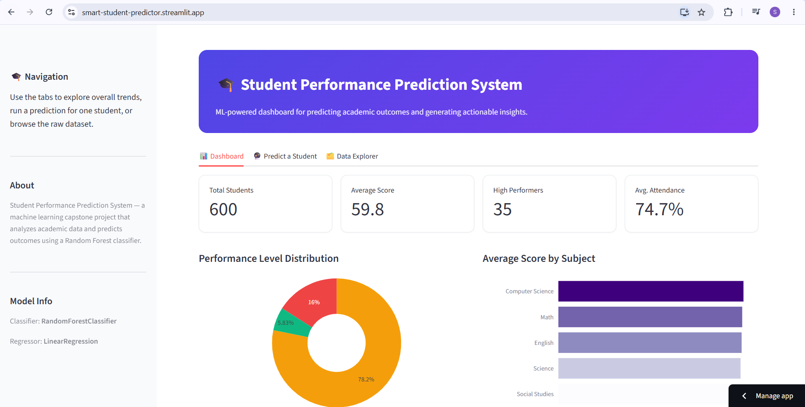
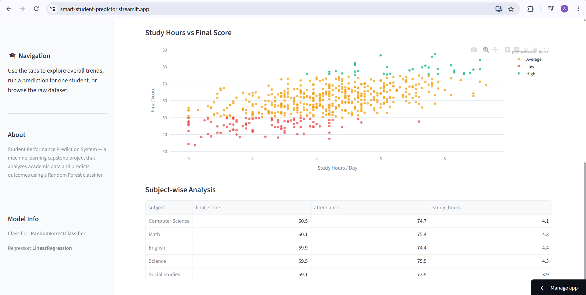
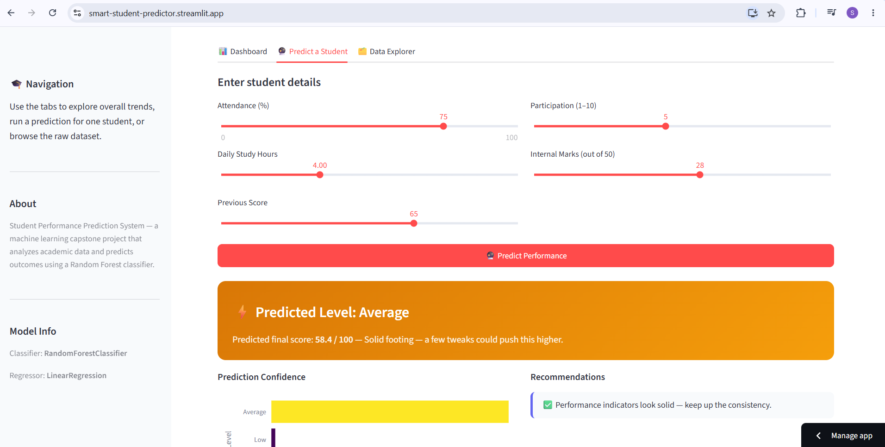

# 🎓 Student Performance Prediction System

**Live demo:** [smart-student-predictor.streamlit.app](https://smart-student-predictor.streamlit.app)

**Submitted by:** Swara Vikas Jadhav | **Institute:** MMCOE | **Program:** SkillOrbit Machine Learning Capstone, 2026

A machine learning project that analyzes student academic data (attendance, study hours, previous scores, participation and internal marks) to predict performance outcomes (High / Average / Low) and generate actionable study recommendations through an interactive dashboard.

## Screenshots

### Dashboard overview
Performance-level distribution and average score by subject.

### Study hours vs final score
Each point is a student, colored by performance level.

### Prediction and recommendations

## Overview

A student's academic outcome is shaped by a few measurable habits: how often they attend, how much they study, and how they have performed before. This project turns those signals into a working prediction tool that a school or ed-tech platform could use to flag at-risk learners early and suggest concrete next steps, instead of reporting grades after the fact.

It covers the full ML workflow: data preparation, exploratory analysis, model training and comparison, and a live dashboard for predictions and recommendations.

## Features

- **Dashboard tab:** KPI cards, performance-level donut chart, average score by subject, study-hours scatter plot, subject-wise table
- **Predict a Student tab:** enter a student's details to get a predicted level, predicted score, prediction confidence and tailored recommendations
- **Data Explorer tab:** browse and download the dataset
- **Recommendation engine:** rule-based suggestions (improve attendance, increase study hours, focus on weak subjects, attend practice sessions)

## Results

| Model | Task | Score |
|---|---|---|
| Decision Tree | Classification (performance level) | 79.2% accuracy |
| **Random Forest** (selected) | Classification (performance level) | **90.8% accuracy** |
| Linear Regression | Regression (final score) | R² = 0.863 |

Study hours and internal marks are the strongest predictors of final score; attendance alone is comparatively weak.

## Dataset

A synthetic dataset of 600 student records was generated (`generate_dataset.py`) because no ready-made dataset was available within the project timeline. It uses realistic value ranges and includes deliberate missing values and duplicate rows so the cleaning step is meaningful.

## Project Structure

student-performance-prediction/
├── data/                        raw and cleaned CSVs
├── charts/                      EDA charts
├── screenshots/                 dashboard screenshots
├── generate_dataset.py          dataset creation
├── preprocess.py                cleaning and preprocessing
├── eda.py                       exploratory data analysis
├── train_model.py               model training and evaluation
├── app.py                       Streamlit dashboard and recommendations
├── requirements.txt
└── README.md

## Tech Stack

Python, Pandas, NumPy, Scikit-learn, Matplotlib, Seaborn, Plotly, Streamlit, GitHub, Streamlit Community Cloud

## Scope

Built with classical machine learning only. Deep learning, real-time monitoring and large-scale platform infrastructure are intentionally out of scope.

## Future Work

- Train on a real institutional dataset
- Explore deep learning for richer feature interactions
- Scale to a multi-institution deployment